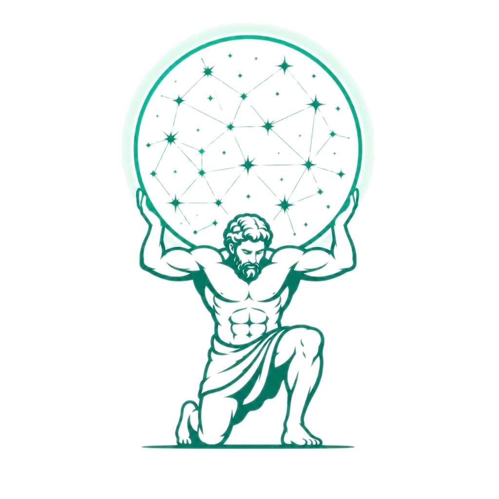
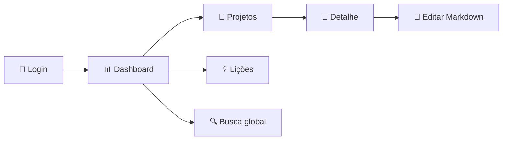

<div align="center">



# Atlas Knowledge

**Wiki corporativa para centralizar conhecimento de projetos em um único lugar**

Documentação, decisões, arquivos, histórico e lições aprendidas — conectados por projeto, prontos para consulta e reutilização.

<br />

[](https://react.dev/)
[](https://www.typescriptlang.org/)
[](https://vite.dev/)
[](README.md)

<br />


</div>

---

## 📑 Índice

- [Sobre o projeto](#-sobre-o-projeto)
- [Funcionalidades](#-funcionalidades)
- [Fluxo principal](#-fluxo-principal)
- [Fase atual](#-fase-atual)
- [Stack tecnológica](#️-stack-tecnológica)
- [Estrutura do repositório](#-estrutura-do-repositório)
- [Como rodar](#-como-rodar)
- [Roadmap](#-roadmap)
- [Visão de produto](#-visão-de-produto)

---

## 💡 Sobre o projeto

O **Atlas Knowledge** é uma wiki corporativa pensada para equipes de produto, engenharia, operação e negócios. Cada projeto ganha uma página própria com documentação em Markdown, responsáveis, status, tecnologias, anexos, lições aprendidas e histórico de mudanças.

> Conhecimento importante costuma ficar espalhado entre conversas, documentos soltos, arquivos locais e memória das pessoas. O Atlas organiza esse conteúdo por projeto e oferece uma experiência visual para consultar, editar e buscar informações relevantes.

### Perguntas que a aplicação ajuda a responder

| | |
|---|---|
| 🎯 | O que esse projeto faz e qual é o seu escopo? |
| 👤 | Quem é a pessoa responsável? |
| 🧭 | Quais decisões já foram tomadas? |
| 📎 | Quais documentos e arquivos estão relacionados? |
| 💡 | Que aprendizados podem orientar próximos projetos? |
| 🕐 | O que mudou recentemente? |

Além de projetos ativos, a proposta é preservar conhecimento de iniciativas pausadas ou concluídas — mantendo decisões e aprendizados acessíveis para novas entregas.

---

## ✨ Funcionalidades

<table>
<tr>
<td width="50%" valign="top">

### 📊 Dashboard
Indicadores de projetos, documentos, lições aprendidas e atualizações recentes em um painel central.

### 📁 Projetos
Listagem com cards, métricas, busca local, filtro por status e linha do tempo de mudanças.

### 📄 Detalhe do projeto
Abas para documentação, arquivos, lições aprendidas e histórico completo.

### 📝 Markdown
Leitor com navegação por seções, subseções e modo tela cheia. Editor com preview em tempo real.

</td>
<td width="50%" valign="top">

### 🔍 Busca global
Pesquisa unificada por projetos, seções, lições aprendidas e histórico de atualizações.

### 💡 Lições aprendidas
Central com filtros por tipo e busca por título, tags, projeto e responsável.

### ➕ Criação de projeto
Formulário com geração de slug, preview visual e documentação inicial em Markdown.

### 🔐 Autenticação
Login integrado à API, controle de sessão e permissões por papel e responsável.

</td>
</tr>
</table>

<details>
<summary><strong>📋 Lista completa de entregas</strong></summary>

<br />

- Shell principal com menu lateral e cabeçalho com busca
- Gestão visual de seções: criar, renomear, remover e reordenar
- Referências a arquivos no Markdown com `[[arquivo:nome-do-arquivo]]`
- Área de anexos com visualização de arquivos do projeto
- Integração com backend REST via Axios
- Tipagem completa em TypeScript para projetos, anexos, lições e histórico
- Componentes reutilizáveis: shell, badges, seletores e visualizador Markdown
- Estilização dedicada por página com tokens visuais globais

</details>

---

## 🔄 Fluxo principal



1. **Login** — autenticação via API com restauração de sessão
2. **Dashboard** — visão geral da base de conhecimento
3. **Projetos** — filtro por status ou busca por termos
4. **Detalhe** — documentação, anexos, lições e histórico
5. **Edição** — atualização de seções com preview antes de salvar
6. **Descoberta** — lições aprendidas e busca global para reutilizar conhecimento

---

## 📍 Fase atual

O projeto está em **protótipo funcional de front-end** integrado a uma API REST. A experiência principal já pode ser navegada e validada visualmente, com fluxos suficientes para demonstrar a proposta de valor da wiki corporativa.

| Área | Status |
|------|--------|
| Interface e navegação | ✅ Implementada |
| Autenticação e sessão | ✅ Integrada à API |
| CRUD de projetos e documentos | ✅ Via backend |
| Busca e filtros | ✅ No cliente |
| Leitura e edição Markdown | ✅ Funcional |
| Upload de anexos | ⏳ Pendente |
| Auditoria completa | ⏳ Pendente |
| Sugestões com IA | 🔮 Planejado |

---

## 🛠️ Stack tecnológica

<div align="center">

[](https://skillicons.dev)

<br />

| Tecnologia | Uso |
|------------|-----|
|  | Interface e componentes |
|  | Tipagem e modelos de dados |
|  | Build e dev server |
|  | Rotas e navegação |
|  | Componentes de UI |
|  | Cliente HTTP para a API |
|  | Ícones da interface |
|  | Qualidade de código |

</div>

---

## 📂 Estrutura do repositório

```
src/
├── components/       # Shell, Markdown, badges e seletores
├── lib/              # API, auth, tipos e funções de projetos
├── pages/            # Dashboard, projetos, lições, busca, login
├── pages/css/        # Estilos específicos de cada tela
├── assets/           # Logo, hero e recursos visuais
├── App.tsx           # Rotas e layout protegido
└── index.css         # Tokens visuais, tema e estilos globais

public/
├── favicon.png       # Ícone da aplicação
└── icons.svg         # Sprite de ícones
```

---

## 🚀 Como rodar

### Pré-requisitos

- [Node.js](https://nodejs.org/) 18+
- Backend Atlas Knowledge rodando (padrão: `http://localhost:8080`)

### 1. Clone e instale

```bash
git clone <url-do-repositorio>
cd atlasKnowledge
npm install
```

### 2. Configure o ambiente

Crie um arquivo `.env` na raiz do projeto:

```env
VITE_API_URL=http://localhost:8080/api/v1
```

### 3. Inicie o servidor de desenvolvimento

```bash
npm run dev
```

A aplicação estará disponível em `http://localhost:5173`.

### Scripts disponíveis

| Comando | Descrição |
|---------|-----------|
| `npm run dev` | Servidor de desenvolvimento com hot reload |
| `npm run build` | Build de produção (TypeScript + Vite) |
| `npm run preview` | Pré-visualiza a build localmente |
| `npm run lint` | Verificação estática com ESLint |

---

## 🔮 Roadmap

- [ ] Upload real de anexos
- [ ] Auditoria completa de alterações
- [ ] Ranking de busca por relevância
- [ ] Filtros avançados por responsável, status e área
- [ ] Sugestões automáticas com IA
- [ ] Templates de documentação por tipo de projeto
- [ ] Métricas de uso por área
- [ ] Geração de documentação a partir de transcrições de reuniões

---

## 🎯 Visão de produto

<div align="center">


<br /><br />

*O Atlas Knowledge busca ser mais do que um repositório de documentos.*

</div>

A intenção é criar uma **memória operacional da empresa**: um lugar onde contexto, decisões e aprendizados fiquem conectados aos projetos que os originaram.

Com isso, novos membros se ambientam mais rápido, equipes evitam repetir erros já identificados e lideranças ganham clareza sobre o estado e o histórico das iniciativas.

---

<div align="center">

**Atlas Knowledge** — *Centralize. Consulte. Reutilize.*

<br />


</div>
