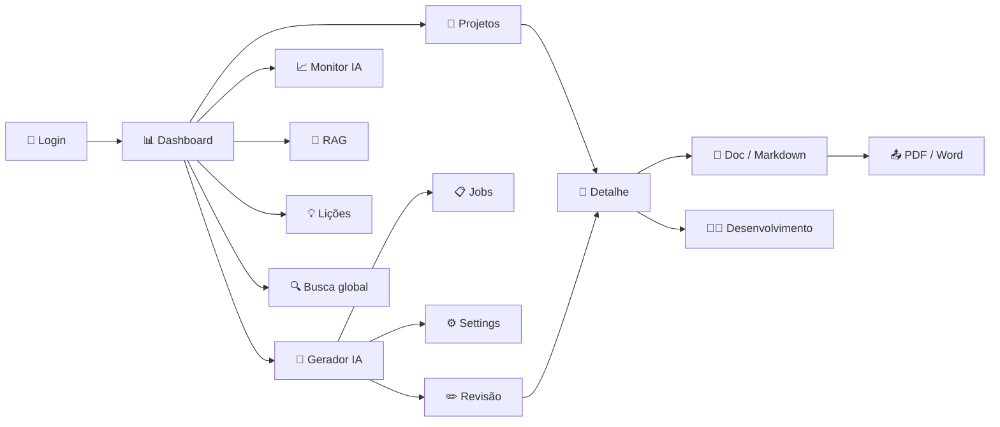
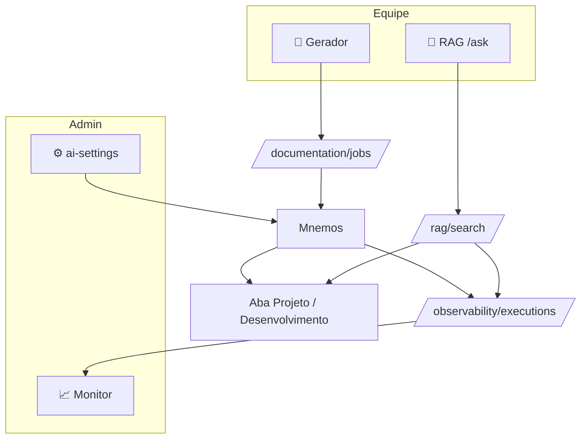

<div align="center">


# Atlas Knowledge

**Wiki corporativa para centralizar conhecimento de projetos em um único lugar**

Documentação, decisões, arquivos, histórico e lições aprendidas — conectados por projeto, prontos para consulta e reutilização.

<br />

[](https://react.dev/)
[](https://www.typescriptlang.org/)
[](https://vite.dev/)
[](README.md)

</div>

---

## 📑 Índice

- [Sobre o projeto](#-sobre-o-projeto)
- [Funcionalidades](#-funcionalidades)
- [Perfis e permissões](#-perfis-e-permissões)
- [Fluxo principal](#-fluxo-principal)
- [Fase atual](#-fase-atual)
- [Novidades recentes](#-novidades-recentes)
- [IA no Atlas](#-ia-no-atlas)
  - [Gerador de documentação](#-gerador-de-documentação)
  - [Configurações de IA](#️-configurações-de-ia)
  - [Monitor de IA](#-monitor-de-ia)
  - [Busca semântica RAG](#-busca-semântica-rag)
- [Stack tecnológica](#️-stack-tecnológica)
- [Estrutura do repositório](#-estrutura-do-repositório)
- [Integração com o backend](#-integração-com-o-backend)
- [Como rodar](#-como-rodar)
- [Roadmap](#-roadmap)
- [Visão de produto](#-visão-de-produto)

---

## 💡 Sobre o projeto

O **Atlas Knowledge** é uma wiki corporativa pensada para equipes de produto, engenharia, operação e negócios. Cada projeto ganha uma página própria com documentação em Markdown, responsáveis, status, tecnologias, anexos, lições aprendidas e histórico de mudanças.

> Conhecimento importante costuma ficar espalhado entre conversas, documentos soltos, arquivos locais e memória das pessoas. O Atlas organiza esse conteúdo por projeto e oferece uma experiência visual para consultar, editar e buscar informações relevantes.

### Perguntas que a aplicação ajuda a responder

| | |
|---|---|
| 🎯 | O que esse projeto faz e qual é o seu escopo? |
| 👤 | Quem é a pessoa responsável? |
| 🧭 | Quais decisões já foram tomadas? |
| 📎 | Quais documentos e arquivos estão relacionados? |
| 💡 | Que aprendizados podem orientar próximos projetos? |
| 🕐 | O que mudou recentemente? |

Além de projetos ativos, a proposta é preservar conhecimento de iniciativas pausadas ou concluídas — mantendo decisões e aprendizados acessíveis para novas entregas.

---

## ✨ Funcionalidades

<table>
<tr>
<td width="50%" valign="top">

### 📊 Dashboard
Indicadores de projetos, documentos, lições aprendidas e atualizações recentes em um painel central.

### 📁 Projetos
Listagem com cards, métricas, busca local, filtro por status e linha do tempo de mudanças.

### 📄 Detalhe do projeto
Abas para documentação, **desenvolvimento**, arquivos, lições aprendidas e histórico completo.

### 🧑‍💻 Aba de Desenvolvimento
Espaço técnico separado da documentação, com seções e anexos próprios, visível apenas para admin e desenvolvedores.

### 📝 Markdown
Leitor com navegação por seções, subseções e modo tela cheia. Editor com preview em tempo real e citações cruzadas.

</td>
<td width="50%" valign="top">

### 🔍 Busca global
Pesquisa unificada por projetos, seções, lições aprendidas e histórico de atualizações.

### 💡 Lições aprendidas
Central com filtros por tipo e busca por título, tags, projeto e responsável.

### 🤖 Gerador de Documentação IA
Upload de arquivos, escolha de tipos (funcional / técnica), pipeline de etapas e acompanhamento de jobs.

### ➕ Criação de projeto
Formulário com geração de slug, preview visual, dev-responsáveis e documentação inicial em Markdown.

### 🔐 Perfis e permissões
Login integrado à API com três perfis (admin, consultor, desenvolvedor) e regras por responsável.

</td>
</tr>
<tr>
<td width="50%" valign="top">

### ⚙️ Configurações de IA
Modal de admin para escolher provider, model, API key e base URL (`PUT /ai-settings`).

### 📈 Monitor de IA
Painel admin com desempenho, erros, qualidade, custos e log de execuções.

</td>
<td width="50%" valign="top">

### 💬 Busca semântica RAG
Perguntas em linguagem natural sobre a documentação indexada, com conversas e fontes.

### 📤 Exportação
Leitor Markdown com tela cheia e download do documento em **PDF** ou **Word**.

</td>
</tr>
</table>

<details>
<summary><strong>📋 Lista completa de entregas</strong></summary>

<br />

- Shell principal com menu lateral e cabeçalho com busca
- Três perfis de usuário (admin, consultor, desenvolvedor) com permissões aplicadas na UI
- Aba de Desenvolvimento com seções e anexos separados da documentação
- Seleção de dev-responsáveis por projeto (Autocomplete com múltipla escolha)
- Status de projeto dinâmico (ativo, pausado, concluído, cancelado) com cores vindas da API
- Gestão visual de seções: criar, renomear, remover e reordenar (documentação e desenvolvimento)
- Upload real de anexos via `multipart/form-data`, com download autenticado
- Referências no Markdown com `[[arquivo:nome-do-arquivo]]` e `[[secao:Título da seção]]`
- Gerador de Documentação IA (`/ai-generator` e `/projects/:slug/ai-generator`)
- Tipos de documentação: **Funcional** → aba Projeto; **Técnica** → aba Desenvolvimento
- Pipeline visual das etapas do Mnemos (OCR só com imagens; transcrição só com áudio)
- Idioma da geração fixo em português
- Configurações de IA (admin): engrenagem no gerador → `GET`/`PUT /ai-settings`
- Providers: OpenAI, Anthropic, Gemini, Ollama e Azure OpenAI, com presets de model
- Monitor de IA (admin): `/ai-monitor` com abas de desempenho, erros, qualidade, custos e execuções
- Diálogos de ajuda no monitor para interpretar percentis e latência por estágio
- Busca semântica RAG (`/ask`) com threads locais e `POST /rag/search`
- Exportação do documento em PDF e Word a partir do leitor Markdown
- Deploy via Docker (`Dockerfile` + `docker-compose.yml`, nginx na porta `8081`)
- Aba de jobs em execução com listagem sob demanda (1 carga ao abrir + Atualizar manual)
- Integração com backend REST via Axios (refresh token automático em `401`)
- Tipagem completa em TypeScript para projetos, anexos, lições, seções e histórico
- Componentes reutilizáveis: shell, badges, seletores e visualizador Markdown
- Estilização dedicada por página com tokens visuais globais

</details>

---

## 🔐 Perfis e permissões

A aplicação trabalha com **três perfis** de usuário. A UI esconde ações conforme o papel, mas a segurança definitiva é responsabilidade do backend.

| Perfil | Aba Projeto | Aba Desenvolvimento | Edição |
|--------|-------------|---------------------|--------|
| **Admin** | ✅ vê | ✅ vê | Tudo, inclusive apagar projeto |
| **Consultor** | ✅ leitura | ❌ não vê | Nenhuma |
| **Desenvolvedor** | ✅ leitura | ✅ vê | Somente aba Desenvolvimento, se for dev-responsável |
| **Responsável** | ✅ vê | conforme perfil | Edita a aba Projeto (doc, arquivos, lições) |

> O responsável edita a aba Projeto; o dev-responsável edita a aba Desenvolvimento. O admin faz tudo.

---

## 🔄 Fluxo principal


```mermaid
flowchart LR
    A[🔑 Login] --> B[📊 Dashboard]
    B --> C[📁 Projetos]
    C --> D[📄 Detalhe]
    D --> E[📝 Doc / Markdown]
    D --> H[🧑‍💻 Desenvolvimento]
    E --> X[📤 PDF / Word]
    B --> I[🤖 Gerador IA]
    I --> J[📋 Jobs]
    I --> S[⚙️ Settings]
    I --> K[✏️ Revisão]
    K --> D
    B --> M[📈 Monitor IA]
    B --> R[💬 RAG]
    B --> F[💡 Lições]
    B --> G[🔍 Busca global]
```

1. **Login** — autenticação via API com restauração de sessão e perfil do usuário
2. **Dashboard** — visão geral da base de conhecimento
3. **Projetos** — filtro por status ou busca por termos
4. **Detalhe** — documentação, desenvolvimento, anexos, lições e histórico
5. **Gerador IA** — envio de arquivos, escolha de tipos, pipeline de etapas e jobs ativos
6. **Configurações de IA** — admin define provider, model e credenciais usadas pelo Mnemos
7. **Monitor de IA** — admin acompanha desempenho, erros, qualidade, custos e execuções
8. **RAG** — perguntas em linguagem natural sobre a documentação indexada
9. **Edição** — atualização de seções com preview antes de salvar (conforme permissão)
10. **Exportação** — PDF ou Word a partir do leitor Markdown
11. **Descoberta** — lições aprendidas e busca global para reutilizar conhecimento

---

## 📍 Fase atual

O front-end está com a **experiência completa modelada e integrada ao contrato de API REST**. Nesta etapa, além dos fluxos base de wiki, perfis e aba de Desenvolvimento, o Atlas cobre **geração de documentação com IA**, **configuração de provider**, **monitor de execuções** e **busca semântica RAG**. O foco continua sendo a **evolução do backend** conforme [`BACKEND_API.md`](BACKEND_API.md).

| Área | Status |
|------|--------|
| Interface e navegação | ✅ Implementada |
| Autenticação e sessão | ✅ Integrada à API |
| Perfis e permissões (admin/consultor/dev) | ✅ Implementados no front |
| Aba de Desenvolvimento (dev-sections/anexos) | ✅ Implementada |
| Dev-responsáveis por projeto | ✅ Implementado |
| Status de projeto dinâmico com cores | ✅ Implementado (com fallback) |
| CRUD de projetos e documentos | ✅ Via backend |
| Upload de anexos | ✅ Implementado (projeto e dev) |
| Gerador de Documentação IA | ✅ Implementado no front |
| Jobs de geração (listar / cancelar / atualizar) | ✅ Implementado |
| Pipeline de etapas (OCR / transcrição / geração) | ✅ Implementado |
| Configurações de IA (`/ai-settings`) | ✅ Implementado (admin) |
| Monitor de IA (`/ai-monitor`) | ✅ Implementado (admin) |
| Busca semântica RAG (`/ask`) | ✅ Implementado |
| Exportação PDF / Word | ✅ Implementado |
| Deploy Docker (nginx) | ✅ Implementado |
| Revisão e publicação pós-IA | ✅ Implementado |
| Busca e filtros | ✅ No cliente |
| Leitura e edição Markdown | ✅ Funcional |
| Implementação do backend | ⏳ Em andamento (contrato definido) |
| Auditoria completa | ⏳ Pendente |
| Regeneração por seção / sugestões contínuas | 🔮 Planejado |

---

## 🆕 Novidades recentes

Melhorias incorporadas na etapa atual do projeto. O detalhe de cada fluxo de IA está em [IA no Atlas](#-ia-no-atlas).

<table>
<tr>
<td width="50%" valign="top">

**🤖 Geração e jobs**

Tela no menu e no projeto, upload em lote, tipos funcional/técnica, pipeline Mnemos e jobs sob demanda.

**⚙️ Provider de chat**

Engrenagem no gerador (admin) para `provider`, `model`, `apiKey` e `baseUrl`.

</td>
<td width="50%" valign="top">

**📈 Observabilidade**

Monitor admin com KPIs, gráficos, CSV e diálogos de ajuda (percentis e estágios).

**💬 RAG + exportação**

Pergunte ao Atlas (`/ask`) e baixe a documentação em PDF ou Word.

</td>
</tr>
</table>

### Gerador de Documentação IA

| O quê | Como |
|-------|------|
| **Tela de geração** | Menu (`/ai-generator`) e detalhe do projeto (`/projects/:slug/ai-generator`) |
| **Upload** | Lote com PDF, Word, Markdown, áudio, planilhas, imagens, etc. — validação de tipo e tamanho |
| **Tipos unificados** | **Funcional** → aba Projeto (`sections`) · **Técnica** → aba Desenvolvimento (`dev-sections`) |
| **Idioma** | Português (fixo no pedido de geração) |
| **Projeto destino** | Novo (admin) ou existente; no fluxo por slug o projeto já vem fixado |
| **Pipeline** | Etapas do Mnemos na UI (OCR só com imagem; transcrição só com áudio) |
| **Jobs** | Listar ativos, cancelar e atualizar sob demanda (1 carga ao abrir; novas buscas no botão Atualizar) |
| **Cliente de API** | `src/lib/documentation-api.ts` — generate, poll, listagem, cancelamento e leitura |

> Documentação Técnica **é** o conteúdo da aba Desenvolvimento. Não existe um tipo separado “Aba Desenvolvimento”.

### Configurações, monitor e RAG

- **Configurações de IA** — botão de engrenagem no gerador (somente admin). Ver [Configurações de IA](#️-configurações-de-ia).
- **Monitor de IA** — `/ai-monitor` (somente admin). Ver [Monitor de IA](#-monitor-de-ia).
- **Busca semântica RAG** — `/ask`. Ver [Busca semântica RAG](#-busca-semântica-rag).
- **Exportação** — dock do leitor Markdown gera PDF ou Word.
- **Docker** — `Dockerfile` + `docker-compose.yml` servem o front com nginx na porta `8081`.

### Base já entregue

- **Três perfis de usuário** — `admin`, `consultor` e `desenvolvedor`, com helpers de permissão (`canViewDev`, `canManageProject`, `canManageDevProject`).
- **Aba de Desenvolvimento** — seções e anexos técnicos separados da documentação funcional.
- **Dev-responsáveis** — seletor com múltipla escolha na criação e edição do projeto.
- **Status dinâmico** — `active`, `paused`, `done`, `cancelled` via `GET /project-statuses` (com fallback).
- **Upload de anexos** — `multipart/form-data` e download autenticado (projeto e desenvolvimento).
- **Citações cruzadas no Markdown** — `[[secao:Título]]` e `[[arquivo:nome]]`.
- **Contrato de API** — rotas e regras em [`BACKEND_API.md`](BACKEND_API.md).

---

## 🤖 IA no Atlas

O Atlas usa IA em três frentes: **gerar documentação**, **consultar a wiki por RAG** e **observar as execuções**. O chat (provider/model) é configurado no próprio Atlas; o embedder segue a política do Mnemos.


```mermaid
flowchart TB
    subgraph Admin
        S[⚙️ ai-settings]
        M[📈 Monitor]
    end
    subgraph Equipe
        G[🤖 Gerador]
        R[💬 RAG /ask]
    end
    S --> Mnemos[Mnemos]
    G --> Jobs[/documentation/jobs/]
    Jobs --> Mnemos
    R --> Rag[/rag/search/]
    Mnemos --> Wiki[Aba Projeto / Desenvolvimento]
    Rag --> Wiki
    Mnemos --> Obs[/observability/executions/]
    Rag --> Obs
    Obs --> M
```

---

### 📄 Gerador de documentação

Envie arquivos e escolha o tipo. O Mnemos processa em etapas; o Atlas acompanha o job e publica o resultado na wiki.

| Tipo | Destino na wiki |
|------|-----------------|
| Documentação **Funcional** | Aba **Projeto** (`sections`) |
| Documentação **Técnica** | Aba **Desenvolvimento** (`dev-sections`) |

Rotas no front: `/ai-generator` e `/projects/:slug/ai-generator`.

---

### ⚙️ Configurações de IA

Somente **admin**. Na tela Gerar com IA, o botão de engrenagem abre o modal e carrega/salva:

| Método | Rota | Quem |
|--------|------|------|
| `GET` | `/ai-settings` | Admin (JWT) |
| `PUT` | `/ai-settings` | Admin (JWT) |

**Payload** (`camelCase` no envio):

```json
{
  "provider": "openai",
  "model": "gpt-4o-mini",
  "apiKey": "sk-...",
  "baseUrl": ""
}
```

A API pode devolver `api_key` / `base_url` em snake_case; o front aceita os dois formatos.

#### Providers

| Valor | Significado |
|-------|-------------|
| `openai` | OpenAI (ou API compatível) |
| `anthropic` | Claude |
| `gemini` | Google Gemini |
| `ollama` | Ollama local |
| `azure` | Azure OpenAI |

#### O que mandar por provider

| Provider | Model (exemplos) | API key | Base URL |
|----------|------------------|---------|----------|
| **openai** | `gpt-4o-mini`, `gpt-4o`, `gpt-4.1-mini` | chave OpenAI | opcional (`https://api.openai.com/v1` ou proxy) |
| **anthropic** | `claude-3-5-sonnet-latest`, `claude-3-5-haiku-latest` | chave Anthropic | opcional (`https://api.anthropic.com`) |
| **gemini** | `gemini-1.5-flash`, `gemini-1.5-pro` | chave Google AI | opcional (`https://generativelanguage.googleapis.com/v1beta`) |
| **ollama** | `llama3.2`, `mistral` | pode ficar vazio | ex. `http://localhost:11434` (Docker: `http://host.docker.internal:11434`) |
| **azure** | **nome do deployment** (não o id genérico da OpenAI) | chave Azure | **obrigatório** — `https://SEU_RESOURCE.openai.azure.com` |

O modal já traz selects com esses presets e a opção **Personalizado…**.

> **Anthropic:** RAG só funciona se o embedder for outro provider; Anthropic não vetoriza.

**Exemplos de retorno**

```json
{ "provider": "gemini", "model": "gemini-1.5-flash", "api_key": "AIza...", "base_url": "" }
```

```json
{ "provider": "azure", "model": "gpt-4o-mini", "api_key": "...", "base_url": "https://meu-recurso.openai.azure.com" }
```

```json
{ "provider": "ollama", "model": "llama3.2", "api_key": "", "base_url": "http://localhost:11434" }
```

Cliente: `src/lib/ai-settings-api.ts`.

---

### 📈 Monitor de IA

Rota `/ai-monitor` — **somente admin**. Consome `GET /observability/executions` e o detalhe por id.

| Aba | Conteúdo |
|-----|----------|
| **Desempenho** | KPIs, séries temporais, percentis e latência por estágio |
| **Erros** | Breakdown por tipo/estágio |
| **Qualidade** | Uso de chunks, documentos e scores |
| **Custos** | Tokens e custo por provider/model |
| **Execuções** | Lista filtrável, CSV e detalhe da execução |

Há diálogos de ajuda para interpretar **percentis** e **latência por estágio**. Períodos: 24 h, 7 dias, 30 dias ou intervalo customizado.

---

### 💬 Busca semântica RAG

Rota `/ask`. Perguntas em linguagem natural sobre a documentação indexada.

| Peça | Detalhe |
|------|---------|
| **API** | `POST /rag/search` com `question` e, opcionalmente, `project_ids` |
| **Resposta** | `answer`, `sources`, `chunks_used`, `score` |
| **Conversas** | Threads guardadas no browser (`src/lib/ask-threads.ts`) |
| **Acesso** | `403` se o usuário não puder ver os projetos consultados |

Cliente: `src/lib/rag-api.ts`.

---

## 🛠️ Stack tecnológica

<div align="center">

[](https://skillicons.dev)

<br />

| Tecnologia | Uso |
|------------|-----|
|  | Interface e componentes |
|  | Tipagem e modelos de dados |
|  | Build e dev server |
|  | Rotas e navegação |
|  | Componentes de UI |
|  | Cliente HTTP para a API |
|  | Ícones da interface |
|  | Qualidade de código |

</div>

---

## 📂 Estrutura do repositório

```
src/
├── components/                 # Shell, Markdown, badges e seletores
│   ├── app-shell.tsx               # Menu (Gerador IA, Monitor, RAG)
│   ├── observability-ui.tsx        # KPIs, gráficos, diálogos de ajuda
│   ├── document-reader-dock.tsx    # Tela cheia + export PDF/Word
│   ├── dev-responsible-select.tsx  # Seletor de dev-responsáveis
│   ├── status-badge.tsx            # Badge de status com cores dinâmicas
│   └── markdown-view.tsx           # Leitor/editor Markdown com citações
├── lib/                        # API, auth, tipos e funções de projetos
│   ├── auth.tsx                    # Contexto de sessão e permissões por perfil
│   ├── ai-settings-api.ts          # GET/PUT /ai-settings
│   ├── documentation-api.ts        # Generate / jobs / documentação IA
│   ├── observability-api.ts        # Execuções do monitor de IA
│   ├── rag-api.ts                  # POST /rag/search
│   ├── ask-threads.ts              # Conversas RAG no browser
│   ├── project-status.tsx          # Provider de status (API + fallback)
│   ├── projects.ts                 # Tipos e modelos do domínio
│   └── projects-api.ts             # Chamadas REST (projetos, seções, anexos)
├── pages/
│   ├── ai-generator.tsx            # Geração, jobs e modal de settings
│   ├── ai-monitor.tsx              # Observabilidade (admin)
│   ├── ask-index.tsx               # Início da busca RAG
│   ├── ask-layout.tsx / ask-thread.tsx
│   ├── project-detail.tsx          # Detalhe (atalho para o gerador + export)
│   └── ...                         # Dashboard, projetos, lições, busca, login
├── types/
│   └── observability.ts            # Execuções, estágios, custos e erros
├── pages/css/                  # Estilos específicos de cada tela
├── assets/                     # Logo, hero e recursos visuais
├── App.tsx                     # Rotas e layout protegido
└── index.css                   # Tokens visuais, tema e estilos globais

public/
├── favicon.png                 # Ícone da aplicação
└── icons.svg                   # Sprite de ícones

Dockerfile / docker-compose.yml # Build Vite + nginx na porta 8081
BACKEND_API.md                  # Contrato de API para o backend
```

---

## 🔌 Integração com o backend

O front consome a API REST via Axios. Todo o contrato esperado (rotas, modelos de dados, autenticação e regras de autorização) está documentado em [`BACKEND_API.md`](BACKEND_API.md).

Pontos principais:

- **Base URL** configurável por `VITE_API_URL` (padrão `http://localhost:8080/api/v1`).
- **Autenticação** com access token JWT (`Authorization: Bearer`) e refresh token em cookie httpOnly; o front refaz a requisição automaticamente após um `401`.
- **Perfis e autorização** aplicados no servidor — o front apenas esconde botões.
- **Rotas espelhadas** para documentação (`sections`) e desenvolvimento (`dev-sections`), o mesmo valendo para anexos.
- **Geração com IA** — `POST /projects/:slug/documentation/generate`, acompanhamento em `/documentation/jobs`, cancelamento e leitura em `/projects/:slug/documentation`.
- **Configurações de IA** — `GET` / `PUT /ai-settings` (admin) com `provider`, `model`, `apiKey`, `baseUrl`.
- **Monitor** — `GET /observability/executions` e `GET /observability/executions/:id` (admin).
- **RAG** — `POST /rag/search` com pergunta e filtro opcional de projetos.
- **Resiliência** — `GET /project-statuses` tem fallback local, então a UI segue funcionando mesmo sem o endpoint.

---

## 🚀 Como rodar

### Pré-requisitos

- [Node.js](https://nodejs.org/) 18+
- Backend Atlas Knowledge rodando (padrão: `http://localhost:8080`)

### 1. Clone e instale

```bash
git clone <url-do-repositorio>
cd atlasKnowledge
npm install
```

### 2. Configure o ambiente

Crie um arquivo `.env` na raiz do projeto:

```env
VITE_API_URL=http://localhost:8080/api/v1
```

### 3. Inicie o servidor de desenvolvimento

```bash
npm run dev
```

A aplicação estará disponível em `http://localhost:5173`.

### 4. Ou rode com Docker

```bash
docker compose up --build
```

O front fica em `http://localhost:8081`. A URL da API é passada no build (`VITE_API_URL`, padrão `http://localhost:8080/api/v1`).

### Scripts disponíveis

| Comando | Descrição |
|---------|-----------|
| `npm run dev` | Servidor de desenvolvimento com hot reload |
| `npm run build` | Build de produção (TypeScript + Vite) |
| `npm run preview` | Pré-visualiza a build localmente |
| `npm run lint` | Verificação estática com ESLint |

---

## 🔮 Roadmap

- [x] Três perfis de usuário e permissões
- [x] Aba de Desenvolvimento com seções e anexos próprios
- [x] Status de projeto dinâmico com cores da API
- [x] Upload real de anexos
- [x] Gerador de Documentação IA (upload e jobs)
- [x] Documentação Técnica alimentando a aba Desenvolvimento
- [x] Pipeline de etapas do Mnemos no gerador
- [x] Configurações de IA (provider / model / credenciais)
- [x] Monitor de IA (desempenho, erros, qualidade, custos, execuções)
- [x] Busca semântica RAG
- [x] Exportação PDF e Word
- [x] Deploy Docker (nginx)
- [ ] Implementação do backend conforme `BACKEND_API.md`
- [ ] Auditoria completa de alterações
- [ ] Ranking de busca por relevância
- [ ] Filtros avançados por responsável, status e área
- [ ] Regeneração por seção e sugestões contínuas com IA
- [ ] Templates de documentação por tipo de projeto
- [ ] Métricas de uso por área
- [ ] Geração a partir de transcrições de reuniões (aprimorar pipeline atual)

---

## 🎯 Visão de produto

<div align="center">


<br /><br />

*O Atlas Knowledge busca ser mais do que um repositório de documentos.*

</div>

A intenção é criar uma **memória operacional da empresa**: um lugar onde contexto, decisões e aprendizados fiquem conectados aos projetos que os originaram.

Com isso, novos membros se ambientam mais rápido, equipes evitam repetir erros já identificados e lideranças ganham clareza sobre o estado e o histórico das iniciativas.

---

<div align="center">

**Atlas Knowledge** — *Centralize. Consulte. Reutilize.*

<br />


</div>
